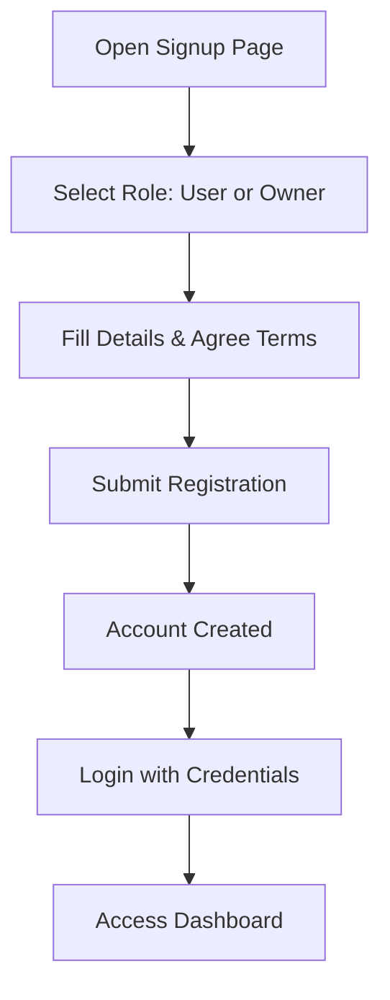
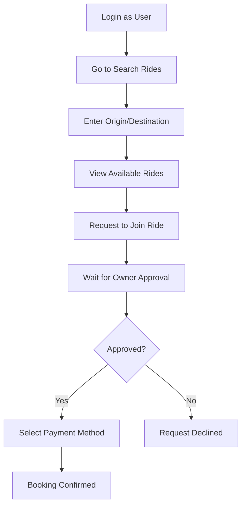
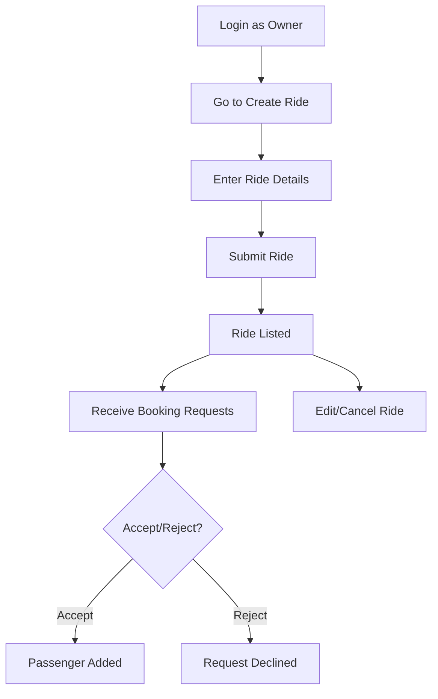
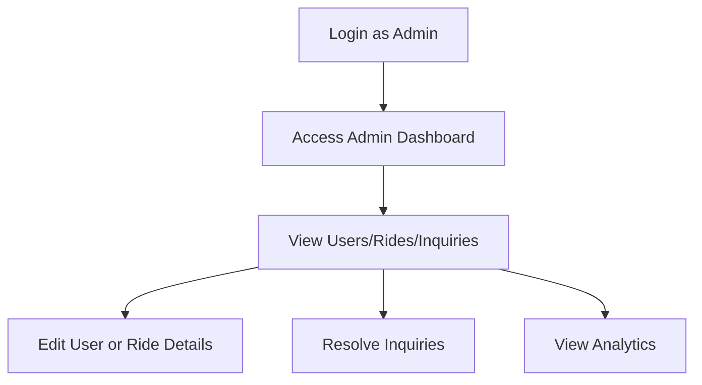
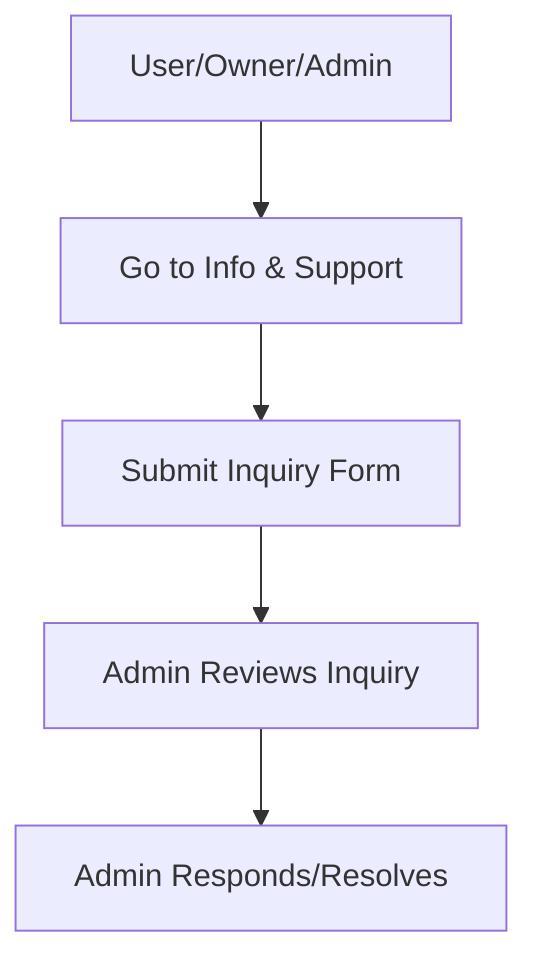

# 🚗 HighwayLink Rideshare System: Features & Activity Flows

## Table of Contents
- [System Overview](#system-overview)
- [User Roles](#user-roles)
- [Main Features](#main-features)
- [Activity Flows](#activity-flows)
  - [User Registration & Login](#user-registration--login)
  - [Searching & Booking a Ride (User)](#searching--booking-a-ride-user)
  - [Creating & Managing Rides (Owner)](#creating--managing-rides-owner)
  - [Admin Management](#admin-management)
  - [Support & Inquiries](#support--inquiries)
- [General Features](#general-features)
- [Project Structure & Flow](#-project-structure--flow)

---

## System Overview
HighwayLink is a ride-sharing platform connecting vehicle owners and passengers for safe, affordable, and eco-friendly travel across Sri Lanka. The system supports three main user roles: User (Passenger), Owner (Vehicle Owner), and Admin.

## User Roles
- **User (Passenger):** Can search, book, and pay for rides.
- **Owner (Vehicle Owner):** Can create rides, manage bookings, and view ride stats.
- **Admin:** Manages users, rides, and system-wide settings.

## Main Features
### For Users
- Browse/search rides by origin/destination
- Request to join rides
- Multiple payment options (Cash/Card)
- Track ride status and booking history
- Submit inquiries/support tickets
- AI-powered chatbot assistance

### For Vehicle Owners
- Create/manage ride offerings
- Set ride schedules (one-time, daily, weekly)
- Accept/reject passenger requests
- Manage vehicle info
- Track rides and passengers

### For Admins
- Manage all users and rides
- View/resolve user inquiries
- Edit ride/user details
- Dashboard with analytics
- System-wide management

### General Features
- Secure JWT authentication
- Responsive UI (Tailwind CSS)
- Real-time updates
- Mobile-friendly design
- Status notifications/alerts

---

## Activity Flows

### User Registration & Login


### Searching & Booking a Ride (User)


### Creating & Managing Rides (Owner)


### Admin Management


### Support & Inquiries


---

## General Features
- Real-time seat availability
- Notifications for booking status
- Dashboard for all roles
- AI Chatbot for help and FAQs

---

## 📂 Project Structure & Flow

```
/frontend/src/
    api/axios.js                → configures API requests (Axios)
    components/
        NavBar.jsx              → navigation bar UI
        RideCard.jsx            → displays ride info
        LocationPicker.jsx      → location input (future: map/GPS)
        Chatbot.jsx             → AI assistant/chat
        CardPaymentGateway.jsx  → handles card payments
        PaymentModal.jsx        → payment modal UI
        MyInquiries.jsx         → user support tickets
        FloatingChatButton.jsx  → opens chatbot
    contexts/
        AuthContext.jsx         → authentication state/context
    pages/
        Home.jsx                → landing page, intro, search
        Login.jsx               → user login
        Signup.jsx              → user/owner registration
        Dashboard.jsx           → user/owner/admin dashboard
        CreateRide.jsx          → ride creation form (owner)
        RideDetails.jsx         → ride info, booking, actions
        SearchRides.jsx         → search/filter rides
        InfoSupport.jsx         → support/inquiry form
    App.jsx                     → main app, routes
    main.jsx                    → React entry point

/src/main/java/com/highwaylink/
    controller/
        AuthController.java     → login, signup, JWT auth
        UserController.java     → user CRUD, profile
        RideController.java     → create/search/book rides
        InquiryController.java  → support/inquiries
    service/
        AuthService.java        → authentication logic
        UserService.java        → user management
        RideService.java        → ride logic (create, book, etc.)
        InquiryService.java     → inquiry logic
    model/
        User.java               → user entity
        Ride.java               → ride entity
        Booking.java            → booking entity
        Vehicle.java            → vehicle info
        Inquiry.java            → support ticket
        Message.java            → chat/inquiry message
    repository/
        UserRepository.java     → user DB access
        RideRepository.java     → ride DB access
        InquiryRepository.java  → inquiry DB access
    config/                     → security, JWT, etc.
    exception/                  → error handling
    util/, response/, DTO/      → helpers, responses, data transfer
    HighwayLinkBackendApplication.java → Spring Boot entry point
```

**Each file/folder above contains functions and logic for its described responsibility. This structure supports clear separation of concerns and easy navigation for development and maintenance.**

---

*This document is presentation-ready and can be extended with screenshots or more diagrams as needed.*
