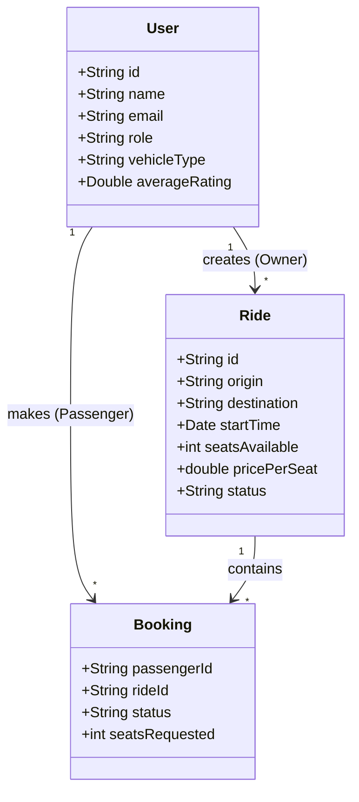
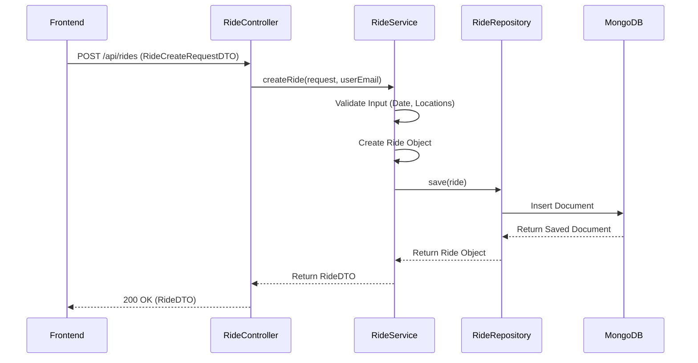

# System Documentation

## 1. High-Level Architecture

The **HighwayLink** system follows a modern layered architecture, separating concerns between the Client (Frontend) and Server (Backend).

### Backend (`src/main/java/com/highwaylink`)
- **Controller Layer**: Handles incoming HTTP requests, performs input validation, and maps endpoints to business logic.
- **Service Layer**: Contains the core business logic, transaction management, and data processing rules.
- **Repository Layer**: Interfaces directly with the MongoDB database using Spring Data.
- **Model Layer**: Defines the data entities (domain objects) that represent real-world concepts like User, Ride, and Booking.

### Frontend (`frontend/src`)
- **Pages**: Top-level views (e.g., Home, Dashboard, CreateRide) that compose the application structure.
- **Components**: Reusable UI elements (e.g., NavBar, RideCard, Forms) for consistency.
- **API Service**: Manages HTTP communication with the backend (Axios).
- **Contexts**: Handles global state management (e.g., AuthContext for user sessions).

---

## 2. Module Description

### Backend Modules
| Module | Path | Purpose |
| :--- | :--- | :--- |
| **Controllers** | `com.highwaylink.controller` | REST API endpoints (Entry point for requests) |
| **Services** | `com.highwaylink.service` | Business logic implementation (Core processing) |
| **Repositories** | `com.highwaylink.repository` | Database access layer (MongoDB interactions) |
| **Models** | `com.highwaylink.model` | POJO classes representing DB documents (User, Ride) |
| **DTOs** | `com.highwaylink.DTO` | Data Transfer Objects for API requests/responses |
| **Config** | `com.highwaylink.config` | Configuration for Security (JWT), CORS, etc. |

### Component Interactions
`RideController` ➔ `RideService` ➔ `RideRepository` ➔ `MongoDB`

---

## 3. Function Hierarchy Diagram (Call Hierarchy)

This diagram illustrates the execution flow for the **"Create Ride"** feature.

```text
RideController.createRide(request, userEmail)
 ├── UserService.getUserByEmail(userEmail)
 │     └── UserRepository.findByEmail(email)
 └── RideService.createRide(request, userEmail)
       ├── validateRequest(request)
       ├── RideRepository.save(ride)
       └── User.update() (if active ride status needs tracking)
```

**Booking a Ride Flow:**
```text
RideController.bookRide(id, userId, seats)
 └── RideService.bookRide(id, userId, seats)
       ├── RideRepository.findById(id)
       ├── Ride.getBookings().add(new Booking(...))
       ├── Ride.setSeatsAvailable(newCount)
       ├── RideRepository.save(ride)
       └── NotificationService.notifyOwner(ownerId, booking)
```

---

## 4. UML Diagrams

### 4.1. UML Class Diagram
Shows the relationships between the main entities.



### 4.2. UML Sequence Diagram (Ride Creation)
Shows the sequence of interactions over time.



### 4.3. UML Activity Diagram (Passenger Booking)
Shows the logic flow for booking.

```mermaid
flowchart TD
    A[Start: User clicks "Book Ride"] --> B{Is User Authenticated?}
    B -- No --> C[Redirect to Login]
    B -- Yes --> D[Check Seat Availability]
    D -- Seats Full --> E[Show Error: "No Seats"]
    D -- Seats Available --> F[Send Booking Request]
    F --> G[Update Ride: Pending Request]
    G --> H[Notify Owner]
    H --> I[End: Specific "Pending" status in Dashboard]
```
